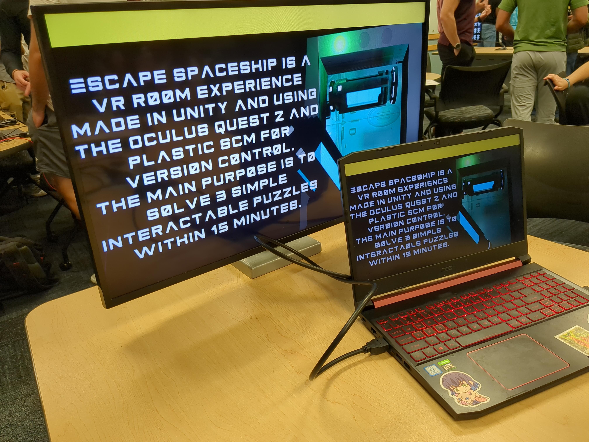
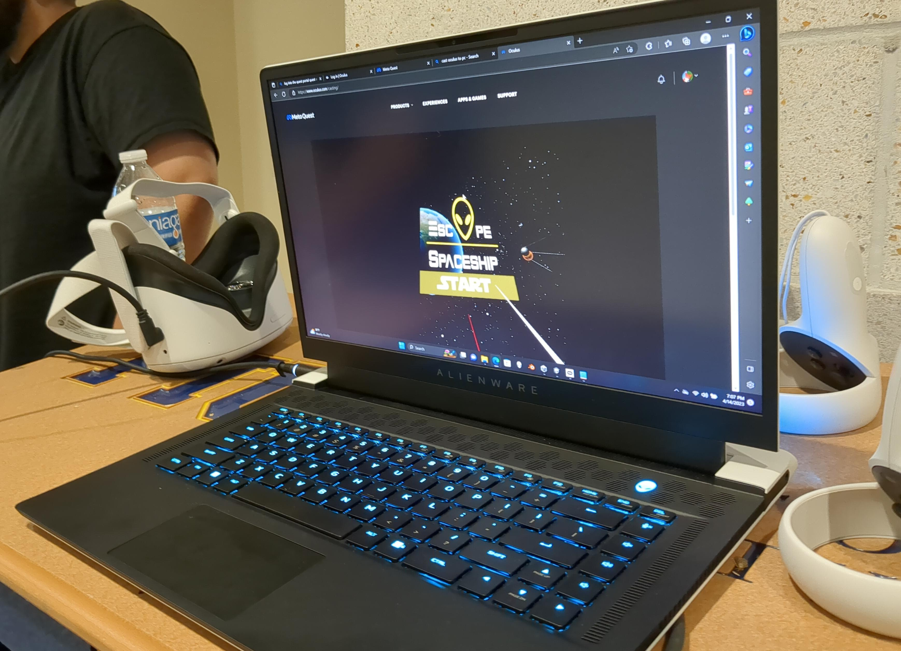
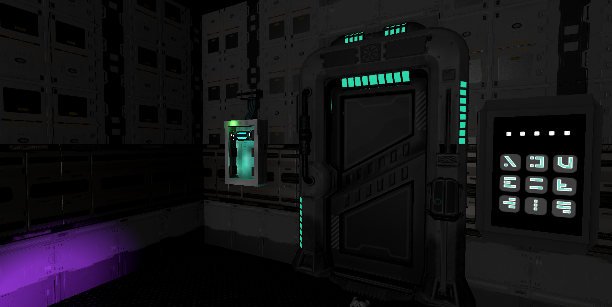
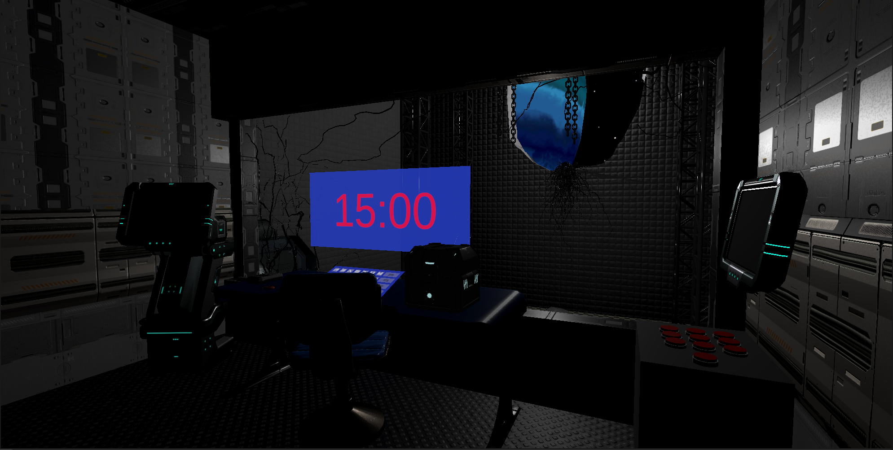

# Escape Spaceship VR

The game takes place in a far-distance future where more and more humans can travel across the galaxy. You, on your trip to another planet, were captured by a group of aliens and they locked you in a tiny room inside their spaceship. You must solve all the puzzles left in the room within the time limit to escape the spaceship.

## Screenshots

## Tech Stack
- VR Headset: Meta Quest 2
- Game Engine: Unity, Unity XR Interaction Toolkit
- Programming Language: C#
- Version Control: PlasticSCM
- 3D Modeling/Editing: Blender, ProBuilder
- Project Management: Trello

## Team Members
- Daniel Santana
- Alfredo Medina
- Cedric Flor Rey
- Christian Laverde
- Allan Martinez
- Vanessa Chu
- Alberto Costa
- Alexander Chirinos
- Fritz Victor
## Credits
### Audio
- Escape Room Scene BGM: https://pixabay.com/music/meditationspiritual-intergalactic-oceans-meditation-132848/
- Door open sound effect: https://www.zapsplat.com/music/science-fiction-door-electronic-slide-open-or-close/
- Keypad wrong password sound effect: https://freesound.org/people/plasterbrain/sounds/423166/
### 3D Models
- Puzzle door: https://skfb.ly/6ULMY
- Sci Fi Corridor: https://www.cgtrader.com/free-3d-models/interior/other/sci-fi-corridor-3d-model-free-726c6978-fe9f-4688-91e6-cfd37932ce62
### Textures
- Blue planet: https://www.cgtrader.com/free-3d-models/space/planet/gas-giant-planet-03-4k
### Fonts
- Alien language keypad font: https://www.1001fonts.com/galactico-font.html
- Game logo font: https://www.fontsdownload.org/primal-font/
